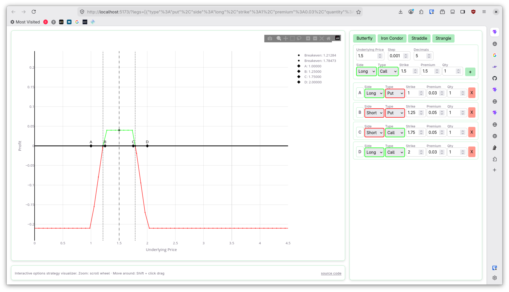

# opts-viz



Interactive options strategy payoff visualizer. Built with Lit, Plotly.js, and Vite.

## Features

- **Payoff graph** — combined P&L curve with green (profit) / red (loss) segments, breakeven lines, underlying price marker
- **Strategy builder** — add/remove/edit legs, load presets (Butterfly, Iron Condor, Straddle, Strangle)
- **Leg inputs** — side (long/short), type (call/put), strike, premium with colored borders
- **URL sharing** — strategy is encoded in query string (`?legs=[...]&u=1.5`)
- **Dark mode** — respects `prefers-color-scheme`

## Usage

```bash
npm run dev      # start dev server
npm run build    # production build
npm run preview  # preview production build
npm run deploy   # build + deploy to gh-pages
```

## Project structure

```
src/
  main.js              — app entry, layout wiring
  components/
    payoff-graph.js     — Plotly chart with P&L curve
    strategy-builder.js — leg management + presets
    leg-input.js        — reusable leg field row
    chart-controls.js   — zoom/pan instructions
  lib/
    options.js          — payoff math (call/put)
    leg-parser.js       — URL encoding/decoding
  styles/
    style.css           — global styles, variables, button classes
    payoff-graph.css    — chart host styles, pos/neg colors
```

## Tech

- [Lit](https://lit.dev/) — web components
- [Plotly.js](https://plotly.com/javascript/) — interactive charts
- [Vite](https://vitejs.dev/) — build tool
- Light DOM — `createRenderRoot() { return this }` for Plotly compatibility
